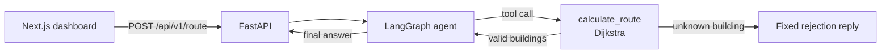

# Agentic Pathfinder

A campus routing assistant. Ask a question in plain English ("Fastest way from the Library to the Dormitory?") and a local LLM agent calls a deterministic Dijkstra tool to find the shortest walking route and total time.

The LLM only interprets the question and phrases the answer. Every route and travel time comes from the graph algorithm, never from the model.

## Tech stack

| Layer | Tools |
|---|---|
| Routing math | NetworkX (Dijkstra) |
| Agent | LangGraph, LangChain, Ollama (`llama3.1:8b`) |
| API | FastAPI, slowapi (rate limiting), tenacity (retries) |
| Frontend | Next.js, Tailwind CSS, shadcn/ui |

## How it works



1. The frontend sends the user's instruction to the API.
2. The agent (Llama 3.1 with a strict system prompt) decides which buildings the user means and calls `calculate_route`.
3. The tool runs Dijkstra on a fixed campus graph and returns the path and total minutes.
4. The agent turns that result into a short answer, which is returned as `calculated_route`.

If the user names a building that doesn't exist, the graph ends with a fixed reply listing the valid buildings instead of handing control back to the LLM. This stops the model from substituting a different building and inventing a route.

## Campus map

Six buildings, connected by two-way paths (weights are walking minutes):

| From | To | Minutes |
|---|---|---|
| Library | Science Hall | 4 |
| Library | Student Union | 3 |
| Library | Admin Building | 6 |
| Science Hall | Engineering | 5 |
| Science Hall | Student Union | 2 |
| Student Union | Dormitory | 7 |
| Student Union | Admin Building | 4 |
| Engineering | Dormitory | 3 |
| Admin Building | Dormitory | 8 |

Building names are case-insensitive, and a leading "the" is ignored ("the library" works).

## Project structure

```
.
├── app/
│   ├── core/tools.py      # Campus graph + calculate_route (Dijkstra)
│   ├── agent/state.py     # AgentState shared by all graph nodes
│   ├── agent/graph.py     # LangGraph agent: LLM, tools, guardrails
│   └── main.py            # FastAPI app: rate limiting, retries, errors
├── frontend/              # Next.js dashboard (chat + monitor panel)
└── requirements.txt
```

## Getting started

### Prerequisites

- Python 3.10+
- Node.js 20+
- [Ollama](https://ollama.com) running locally

### 1. Pull the model

```bash
ollama pull llama3.1:8b
```

The exact tag matters: a bare `llama3.1` resolves to `llama3.1:latest`, which is a different download.

### 2. Start the backend

```bash
pip install -r requirements.txt
uvicorn app.main:app --reload --reload-dir app
```

The API runs at `http://127.0.0.1:8000`, with interactive docs at [http://127.0.0.1:8000/docs](http://127.0.0.1:8000/docs). `--reload-dir app` stops the server from restarting whenever files under `frontend/node_modules` change.

### 3. Start the frontend

```bash
cd frontend
npm install
npm run dev
```

Open [http://localhost:3000](http://localhost:3000).

To point the frontend at a different API address, set `NEXT_PUBLIC_API_URL` (defaults to `http://127.0.0.1:8000`).

## API

### `POST /api/v1/route`

Request:

```json
{ "user_instruction": "Fastest way from the Library to the Dormitory?" }
```

Response:

```json
{ "calculated_route": "The fastest way from the Library to the Dormitory is to go through the Student Union. The total travel time is 10 minutes." }
```

| Status | Meaning |
|---|---|
| 200 | Route (or a rejection for an unknown building) in `calculated_route` |
| 422 | `user_instruction` is empty, whitespace only, or over 500 characters |
| 429 | Rate limit exceeded (5 requests per minute per IP) |
| 500 | The agent failed after all retries; returns a generic message, details are logged server-side |

## Reliability features

- **Rate limiting:** 5 requests per minute per client IP, since each request can trigger several LLM calls.
- **Retries:** failed agent runs are retried up to 3 times with exponential backoff (1s, then 2s) to absorb Ollama hiccups.
- **Loop cap:** each request is limited to 10 graph steps, and a run that hits the cap is not retried.
- **Deterministic answers:** the LLM runs at `temperature=0`.
- **Safe errors:** 500 responses never expose stack traces or internal details, and include CORS headers so the frontend can display them.

## Known limitations

- The rate limiter stores counts in memory, so each worker process counts separately and counts reset on restart. Use a shared store such as Redis for multi-worker deployments.
- Behind a reverse proxy, run uvicorn with `--proxy-headers`, otherwise every client shares the proxy's rate limit.
- CORS only allows `http://localhost:3000` and `http://127.0.0.1:3000`. Add your production origin in `app/main.py`.
- The 8B model occasionally makes an unnecessary tool call for non-routing questions, though its answers stay correct.
- The "Campus Map & Agent State" panel is a placeholder; routes are not visualized yet.
